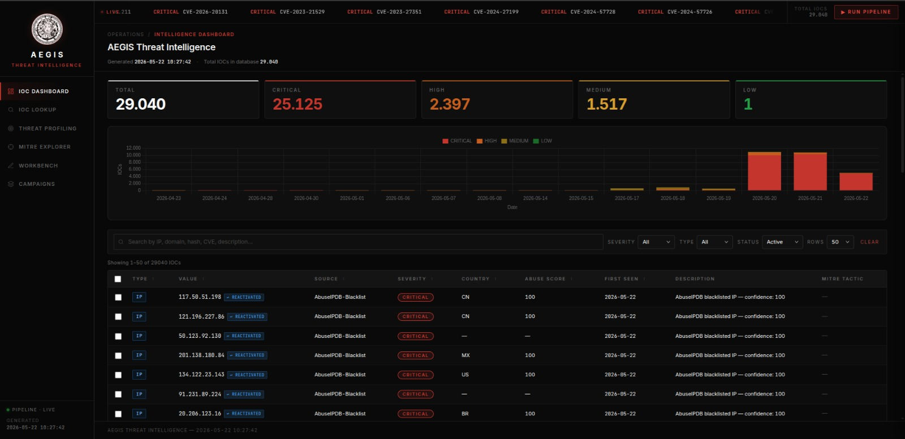
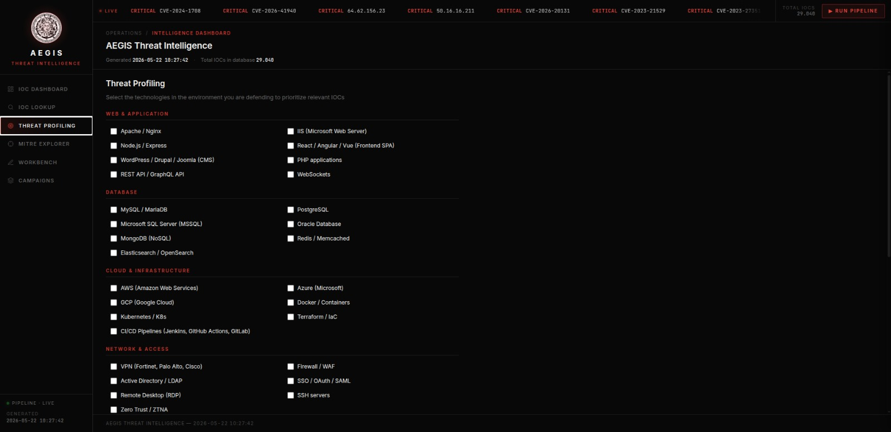
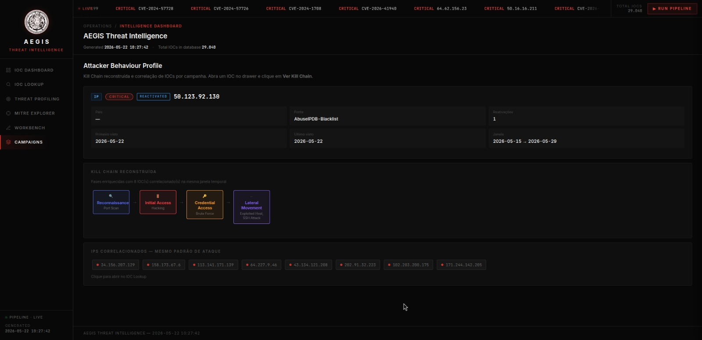
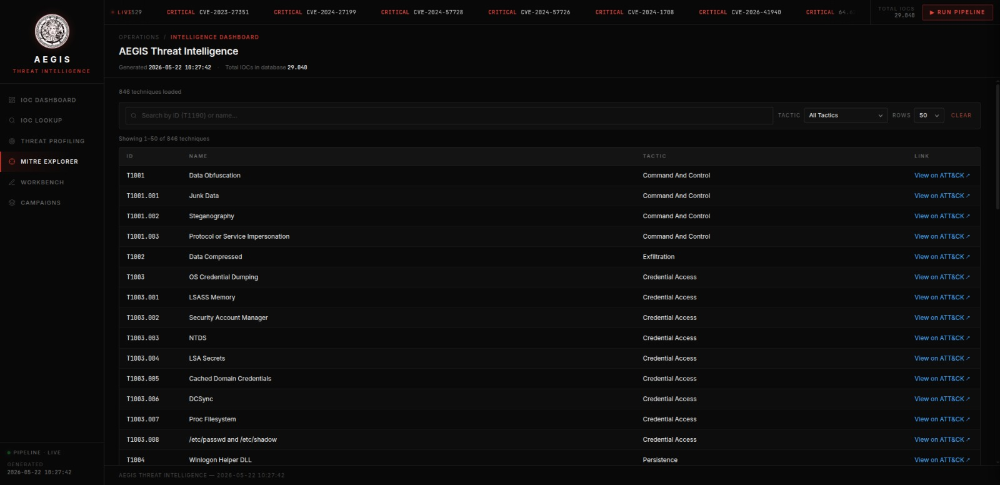
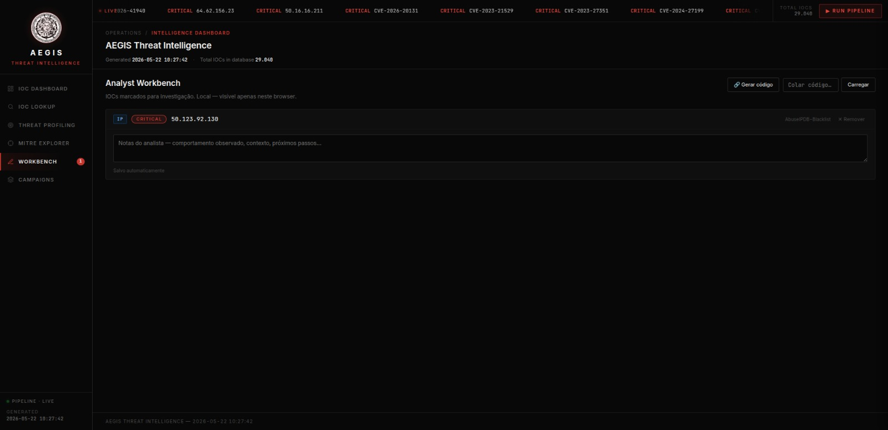

https://github.com/user-attachments/assets/786e04cd-4229-4063-966a-e25c1241c92b


# AEGIS Threat Intelligence

> Plataforma open source de Cyber Threat Intelligence (CTI) com pipeline automatizado, scoring auditável e Kill Chain reconstruída por atacante — acessível via browser, sem instalação.

**🌐 Acesse ao vivo:** [aegiscti.me](https://aegiscti.me)

---

## O que é o AEGIS?

O AEGIS é uma plataforma de inteligência de ameaças cibernéticas construída do zero por um único desenvolvedor. Ele coleta, normaliza, enriquece e correlaciona IOCs (Indicators of Compromise) de 6 fontes públicas em tempo real, entregando contexto acionável para analistas SOC — sem depender de ferramentas pagas.

O diferencial não é apenas agregar feeds: é transformar dados brutos em **inteligência interpretável**, com scoring auditável, decay automático por tipo de IOC, Kill Chain reconstruída por atacante e handoff de turno entre analistas.

---

## Funcionalidades

### IOC Dashboard
Visão consolidada de todos os indicadores ativos com filtros por severidade, tipo, status e busca full-text. Suporte a exportação em CSV compatível com SIEMs (Splunk, QRadar, Microsoft Sentinel).



### Threat Profiling por Asset
O analista cadastra as tecnologias do ambiente que está defendendo — Apache, MySQL, AWS, Active Directory, etc. O sistema filtra automaticamente os IOCs relevantes para aquele stack específico, separando o que é ruído do que é ameaça real.



Nenhuma ferramenta CTI gratuita do mercado faz isso.

### Campaigns — Attacker Behaviour Profile
Ao abrir qualquer IOC e clicar em **Ver Kill Chain**, o sistema reconstrói o comportamento completo do atacante com base em dados reais reportados por analistas no AbuseIPDB, mapeados para o framework MITRE ATT&CK.



Em vez de ver "score 100", o analista vê:
```
Reconnaissance → Initial Access → Credential Access → Lateral Movement
Port Scan         Hacking           Brute Force         SSH Attack
T1046             —                 T1110               T1021.004
```

Com correlação de IPs que apresentaram o mesmo padrão de ataque na mesma janela temporal.

### MITRE ATT&CK Explorer
Navegação completa pelas técnicas do framework MITRE ATT&CK carregadas automaticamente pelo pipeline, com filtro por tática e busca por ID ou nome.



### Analyst Workbench
Área de investigação local por analista — pina IOCs suspeitos, escreve notas de contexto e gera um código de compartilhamento para handoff de turno. O próximo analista cola o código e vê os IOCs e anotações em modo leitura.



Resolve o problema de handoff entre turnos em SOCs 24/7 sem depender de e-mail ou planilha.

---

## Fontes de Dados

| Fonte | Tipo | Volume |
|---|---|---|
| CISA KEV | CVEs explorados ativamente | ~75 recentes |
| AlienVault OTX | IPs, domínios, hashes, URLs | ~300 por run |
| ThreatFox | Malware e C2 | variável |
| URLhaus | URLs maliciosas | até 2.000 |
| Feodo Tracker | IPs de botnet C2 | ~5 |
| AbuseIPDB Blacklist | IPs com histórico de abuso | até 10.000 |

**Total atual no banco: ~29.000 IOCs ativos**

---

## Scoring — BioSec Framework

Cada IOC recebe um score auditável calculado por três componentes:

```
Score = (S × 0.40) + (C × 0.30) + (T × 0.30)
```

| Componente | Descrição |
|---|---|
| **S** — Source Reliability | Confiabilidade da fonte (CISA=100, Feodo=85, ThreatFox=80...) |
| **C** — Corroboration | Quantas fontes independentes confirmaram o IOC |
| **T** — Type Severity | Para CVEs: CVSS real da NVD. Para IPs: score do AbuseIPDB |

O breakdown completo é auditável por IOC no drawer, com links para as fontes de referência.

### Decay Automático
IOCs perdem relevância com o tempo de forma diferenciada por tipo:

| Tipo | Meia-vida |
|---|---|
| URL | 7 dias |
| IP | 15 dias |
| Domínio | 30 dias |
| Hash | 180 dias |
| CVE | 365 dias |

Equação: `score_atual = score_original × e^(−0.693 × dias / meia_vida)`

---

## Stack Técnica

| Camada | Tecnologia |
|---|---|
| Backend | Python 3.11 + FastAPI |
| Banco de dados | PostgreSQL (Render) |
| ORM | SQLAlchemy 2.0 |
| Orquestração | Apache Airflow (pipeline diário 08:00 UTC) |
| Deploy | Render (web service + PostgreSQL) |
| Monitoramento | Sentry |
| Template engine | Jinja2 |
| Integração SIEM | TAXII 2.1 / STIX 2.1 |

---

## API

A plataforma expõe uma API REST documentada com autenticação por API Key:

```bash
# Lookup de um IOC
GET /api/lookup/{value}

# IOCs paginados com filtros
GET /api/iocs?page=1&severity=CRITICAL&type=ip

# Contexto completo de um IOC
GET /api/iocs/{value}/context

# Kill Chain e correlações
GET /api/iocs/{value}/campaign

# Estatísticas da plataforma
GET /api/stats

# Feed TAXII 2.1 compatível com Splunk/QRadar
GET /taxii/collections/critical/objects/

# Exportação em batch (até 10 IOCs)
POST /api/lookup/batch
```

---

## Integrações SIEM

O AEGIS exporta IOCs em dois formatos:

**CSV SIEM** — exportação selecionada diretamente pelo dashboard com campos:
`indicator_type, indicator_value, severity, confidence_score, ioc_status, source, country_code, mitre_tactic, mitre_technique_id, mitre_technique_name, cvss_score, first_seen, last_seen`

**TAXII 2.1 / STIX 2.1** — feed compatível com Splunk, QRadar e Microsoft Sentinel via endpoint `/taxii/`. IDs determinísticos via UUID5 — o mesmo IOC sempre gera o mesmo STIX ID.

---

## Estrutura do Projeto

```
aegis-threat-intelligence/
├── src/
│   ├── collectors/          # CISA, OTX, ThreatFox, URLhaus, Feodo, AbuseIPDB, MITRE
│   ├── processors/          # Normalizer, Classifier, Deduplicator
│   ├── storage/             # DatabaseManager, MITRE cache, Shared Workbench
│   └── reporters/           # Gerador de relatório HTML
├── templates/
│   └── report.html          # Dashboard completo (SPA com 6 abas)
├── assets/                  # Logo e arquivos estáticos
├── src/api.py               # FastAPI — 15+ endpoints
├── src/main.py              # Orquestração do pipeline
└── docker-compose.yml       # Airflow local
```

---

## Sobre o Projeto

Desenvolvido como projeto de portfólio durante transição de carreira para Cibersegurança, com foco em SOC N1 / Blue Team e DevSecOps.

O AEGIS resolve problemas reais documentados no **SANS 2025 CTI Survey**:
- 62% da inteligência coletada não se torna acionável
- Ausência de decay automático em feeds CTI
- Falta de contexto tático para analistas N1
- Sem mecanismo de handoff entre turnos de SOC

**GitHub:** [github.com/mateusdias96cs/aegis-threat-intelligence](https://github.com/mateusdias96cs/aegis-threat-intelligence)
**Demo:** [aegiscti.me](https://aegiscti.me)
